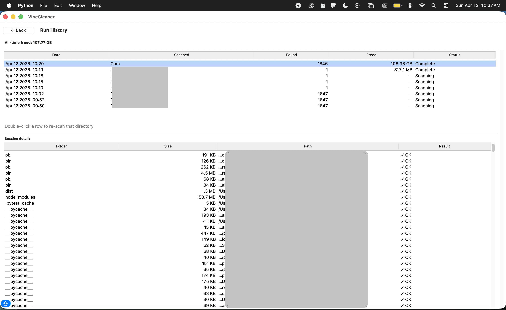
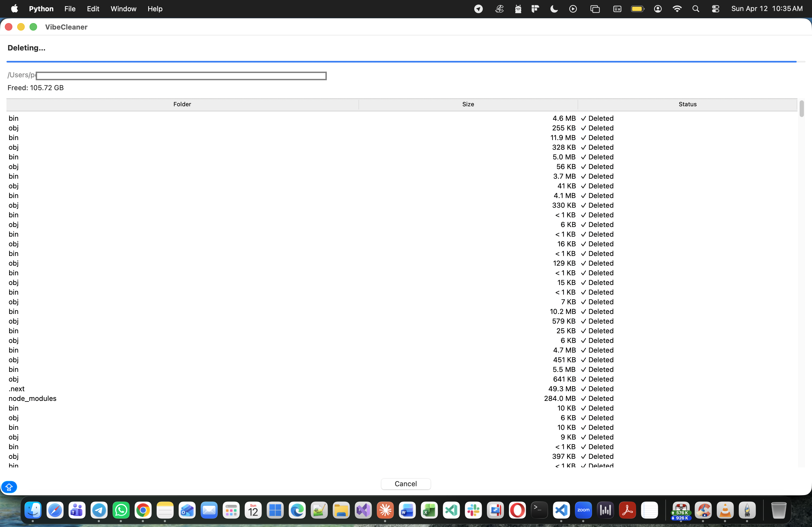
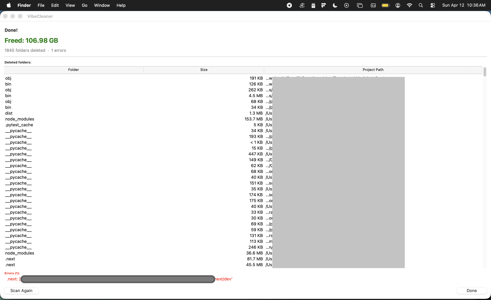

# VibeCleaner

> *"I'll finish it this weekend."* — Every developer, every weekend, since 2008.

**Reclaim disk space by wiping build artifacts and dependency caches across all your dev projects — safely, visually, in seconds.**

---

## The Dirty Truth Nobody Talks About

You know that feeling. It's 11pm on a Tuesday. You've just discovered WebSockets, or Rust, or some obscure Lisp dialect. You clone a repo, run `npm install`, generate 847 MB of `node_modules`, write 12 lines of code, get distracted by a Hacker News thread, and never open the project again.

Multiply that by your entire career.

That's your hard drive right now.

Somewhere in `~/Projects`, there are folders with names like:
- `blockchain-idea/` — from your "I should learn Web3" phase
- `rust-rewrite/` — it was going to be so fast
- `ai-startup/` — just needed "one more feature" before launch
- `that-thing-for-mom/` — she still asks about it

These projects aren't dead. They're *resting*. They just happen to have 3 GB of `node_modules` that haven't been touched since the Obama administration.

**The GitHub Graveyard is real.** See: [programmerhumor.io/memes/github-graveyard](https://programmerhumor.io/memes/github-graveyard)

The rule of the graveyard: thou shalt never delete a project, for you might finish it someday. But also thou shalt never actually finish it.

**VibeCleaner respects the graveyard.** We don't delete *your projects*. We just delete the 47 GB of regenerable junk that's weighing down their tombstones.

---

## The Numbers (aka Your Personal Shame Report)

Every active developer accumulates gigabytes of regenerable junk without realising it:

| Artifact | Typical Size | How long since you touched it |
|---|---|---|
| `node_modules` in 5 abandoned side projects | ~3 GB | "A while" |
| `target/` from that Rust experiment | ~2 GB | Since you rage-quit the borrow checker |
| Python `.venv` environments | ~1.5 GB | Which Python version even is that |
| Xcode `DerivedData` | ~15 GB | It never stops growing. Ever. |
| Your will to finish side projects | 0 bytes | Gone |

These folders are 100% regenerable — `npm install`, `cargo build`, or `python -m venv` brings them back in minutes. But they silently pile up while you're heads-down starting your *next* unfinished project.

**VibeCleaner finds every one of them, shows you exactly how much space you'll get back, and deletes them in one click.** It understands 30+ ecosystems, uses contextual verification to avoid false positives (e.g. a `bin/` folder is only flagged when a `.csproj` sibling confirms it's a .NET build output), and keeps a full audit log of every cleanup session.

---

## Supported Graveyard Ecosystems

We speak fluent abandoned project in 30+ languages:

| Folder | Ecosystem | Risk |
|---|---|---|
| `node_modules` | JavaScript / Node.js | Safe |
| `.next` | Next.js | Safe |
| `.nuxt` | Nuxt.js | Safe |
| `dist`, `build`, `out` | Various JS/TS | Verify (needs `package.json` / `tsconfig.json` sibling) |
| `target` | Rust / Java Maven | Verify (needs `Cargo.toml` / `pom.xml`) |
| `__pycache__` | Python | Safe |
| `.venv`, `venv` | Python virtual envs | Safe |
| `.gradle` | Java / Android | Safe |
| `Pods` | iOS CocoaPods | Safe |
| `DerivedData` | Xcode | Safe (aggressively) |
| `bin`, `obj` | .NET / C# | Verify (needs `.csproj` / `.sln`) |
| `.dart_tool` | Dart / Flutter | Safe |
| `.angular`, `.turbo`, `.parcel-cache`, `.expo` | Frontend tooling | Safe |
| `.terraform` | Terraform | Safe (the infra was never deployed anyway) |
| `vendor` | Go / PHP | Verify (needs `go.mod` / `composer.json`) |
| `coverage`, `.pytest_cache`, `.mypy_cache`, `.ruff_cache` | Testing / linting | Safe |
| `_build`, `deps` | Elixir / Phoenix | Safe |
| `.cache`, `.tmp` | Various | Safe |

---

## How to Run

### Requirements

- Python 3.9+
- No external dependencies — uses only the standard library (`tkinter`, `argparse`, `json`, `shutil`, `threading`)
- A willingness to confront the physical evidence of your abandoned dreams

### GUI (Desktop App)

```bash
python source/vibecleaner.py
```

The GUI launches automatically when no arguments are passed.

**Workflow:**

1. **Welcome screen** — select one or more root directories (previously used directories appear as one-click shortcuts)
2. **Scan** — VibeCleaner recursively walks your directories and streams results into a sortable table
3. **Review** — sort by size, filter by ecosystem or risk level, use "Select All Safe" for a quick bulk selection
4. **Dry Run (optional)** — enable Dry Run mode to preview exactly what would be deleted without touching the filesystem
5. **Clean** — confirm the deletion list and watch the progress bar tick through each folder
6. **Summary** — see total space freed, any errors, and a clickable list of every deleted folder's parent project. Weep softly.

### CLI (Headless / Scripting)

```bash
# Scan one or more directories and print a table
python source/vibecleaner.py --cli ~/Projects

# Scan multiple roots (for the prolific abandoner)
python source/vibecleaner.py --cli ~/Projects ~/Work ~/code ~/that-folder-you-forgot-about

# JSON output (pipe to jq, scripts, CI)
python source/vibecleaner.py --cli ~/Projects --json

# Only show folders larger than 500 MB
python source/vibecleaner.py --cli ~/Projects --min-size 500

# Help
python source/vibecleaner.py --cli --help
```

**Example table output** (actual numbers may trigger an existential crisis):

```
Folder          Ecosystem            Category       Risk     Size       Last Modified  Path
-----------     -------------------  -------------  -------  ---------  -------------  ----------------------------
DerivedData     Xcode                Build          safe     14.32 GB   Apr 08, 2026   /Users/you/Library/Developer
node_modules    JavaScript / Node    Dependencies   safe     817.1 MB   Mar 22, 2026   /Users/you/Projects/myapp
target          Rust / Java Maven    Build          verify   2.04 GB    Feb 14, 2026   /Users/you/Projects/backend
.venv           Python               Virtual env    safe     340.7 MB   Jan 30, 2026   /Users/you/Projects/ml-exp
```

**JSON output shape:**

```json
{
  "scanned_dirs": ["/Users/you/Projects"],
  "total_reclaimable_bytes": 18432819200,
  "total_reclaimable": "17.16 GB",
  "entries": [
    {
      "folder": "DerivedData",
      "ecosystem": "Xcode",
      "category": "Build",
      "risk": "safe",
      "size_bytes": 15382974464,
      "size": "14.32 GB",
      "last_modified": "Apr 08, 2026",
      "project_path": "/Users/you/Library/Developer/Xcode",
      "full_path": "/Users/you/Library/Developer/Xcode/DerivedData"
    }
  ]
}
```

---

## How It Works

### 1. Pattern Registry

VibeCleaner maintains a registry of 30+ known cleanable folder names, each annotated with:
- **ecosystem** — what tool generates it
- **category** — build output, cache, virtual env, dependencies, etc.
- **risk** — `safe` (always delete) or `verify` (only flag if confirming sibling files exist)
- **verify** — glob patterns for sibling files that confirm the folder is genuinely a build artifact
- **verify_location** — whether to look in the `parent` directory, `inside` the folder itself, or `grandparent`

### 2. Scanner

The `Scanner` class uses `os.walk` with top-down traversal. When it encounters a directory whose name matches a registered pattern:

1. It checks the risk level. If `safe`, it records the entry immediately.
2. If `verify`, it inspects the relevant location (e.g. checks for `package.json` next to a `dist/` folder). Only if a confirming file is found does it add the entry.
3. It **prunes the directory** from `os.walk`'s traversal — so it never descends into `node_modules/node_modules/...`, keeping the scan fast even on deeply nested monorepos.
4. Symlinks are never followed (configurable).
5. `PermissionError` and `OSError` are silently skipped with a counter shown to the user.

Size calculation runs lazily on a background thread so the UI stays responsive while hundreds of results stream in.

### 3. Cleaner

The `Cleaner` class deletes `FolderEntry` objects **sequentially** (never in parallel) with two hard safety guards before each deletion:

- The path must not be a symlink.
- The folder name must exist in the registered pattern list.

Each deletion produces a `DeletionResult` (success/error, bytes freed, timestamp) which feeds the progress UI and is persisted to the session history log.

**Dry Run mode** short-circuits the actual `shutil.rmtree` call — the entire UI flow (confirmation → progress → summary) runs identically, but nothing touches the filesystem.

### 4. Session History & Persistence

Every scan and deletion session is written to a JSON log in the app config directory (`~/.vibecleaner/` on macOS/Linux, `%APPDATA%\VibeCleaner` on Windows). The GUI's **Run History** screen makes every past session browsable with a detail panel showing each deleted folder and its result. Double-clicking a row re-scans that directory.

Previously selected scan directories are persisted and shown as one-click shortcuts on the Welcome screen.

A rotating log file captures all warnings and errors for debugging.

### 5. GUI Architecture

The GUI is built with Tkinter (zero external dependencies). `GuiApp` is a single-window frame switcher — screens are `WelcomeFrame`, `ResultsFrame`, and the deletion/summary/history views. Background work (scanning, size calculation) runs on daemon threads and communicates with the UI exclusively via thread-safe queues, so the main thread is never blocked.

---

## App Screens

### Run History
Browse every scan and deletion session. Click a row to see each folder deleted, its size, and whether it succeeded. Double-click to re-scan that directory.



### Deletion in Progress
A live progress bar streams through each folder as it's deleted. Total space freed updates in real time. Cancel at any time — the partial summary shows everything completed so far.



### Deletion Complete
106.98 GB freed in a single run. The summary lists every deleted folder with its project path, a total space bar, and an option to scan again immediately. This is the closest thing to a dopamine hit your hard drive will ever give you.



---

## Safety Guarantees

We are ruthless about disk space. We are gentle about your feelings (and your code).

- **Only registered patterns are ever deleted.** An unrecognised folder name is an instant skip, no exceptions.
- **Symlinks are never deleted** — only real directories.
- **`verify` risk folders require confirming sibling files** — `dist/` is not deleted unless `package.json` or `tsconfig.json` is present next to it.
- **Deletion is sequential, not parallel** — one folder at a time, so a crash or cancel never leaves a half-deleted project in an inconsistent state.
- **Source files are never touched** — VibeCleaner only deletes the specific subfolder it identified. `.git`, `.env`, source files, and config files in the parent project are never affected.
- **Dry Run mode** lets you preview the full deletion flow without touching anything. Great for trust issues.

---

## Scheduled Nightly Cleanup

VibeCleaner v2 introduces **automated nightly cleanup** — set it once and reclaim disk space from stale projects without thinking about it.

### What It Does

Every night at your configured time (default: 2:00 AM), VibeCleaner:

1. Scans each configured root directory (e.g. `~/Projects`)
2. For every **direct child folder** (= one "project"), checks the last-modified time of all **non-artifact source files**
3. If no source file has been touched in **5 days** → the project is **stale**
4. Stale projects have their artifact folders (node_modules, .venv, target, etc.) deleted
5. A Run History entry is created with full detail of what was cleaned and what was skipped

Your source code is never touched — only build artifacts are deleted.

### How to Enable

**GUI**: Click **Schedule** in the top-right of the main window → toggle "Enable nightly scheduled cleanup" → confirm the dialog.

**Verify it's running**: Check Run History — after the first run you'll see a row with a **Scheduled** badge.

### Settings

| Setting | Default | Description |
|---|---|---|
| Enable nightly cleanup | Off | Master on/off switch |
| Run time | 2:00 AM | Hour and minute (24-hour format) |
| Notifications | On | OS notification on completion |
| Include verify-risk folders | Off | Also clean dist/, bin/, vendor/ |

### Run Now

Click **Run Now** in the Schedule settings to trigger an immediate cleanup using your current settings. This does not count as the day's scheduled run.

### How It Runs When the App Is Closed

**macOS**: A launchd agent (`com.vibecleaner.scheduler`) is registered in `~/Library/LaunchAgents/` and fires `vibecleaner.py --run-scheduled` at the configured time, even when the app is closed.

**Windows**: A Windows Task Scheduler task (`VibeCleaner\NightlyCleanup`) is created and fires daily at the configured time.

**Catch-up**: If the machine was asleep at the scheduled time, the in-app daemon detects the missed run within 60 seconds of the app opening and fires immediately.

### Verifying a Run Happened

Open **History** → look for rows labelled **Scheduled**. Click any row to see:
- Which folders were deleted (with sizes and project paths)
- Which projects were **skipped** (with the reason: recent activity, no source files, permission error)

---

> *The projects in `~/Projects` are not dead. They are merely sleeping. But their `node_modules` folders? Those we bury.*

Keep Dreaming! Keep Vibing!
